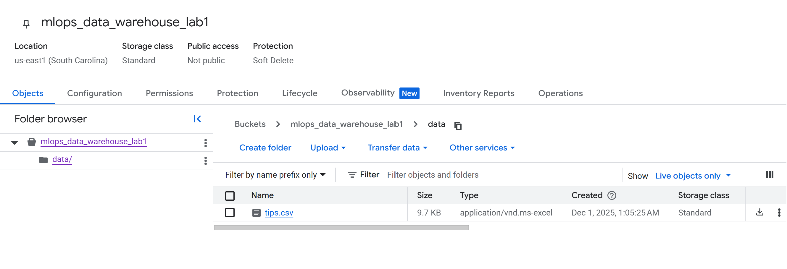
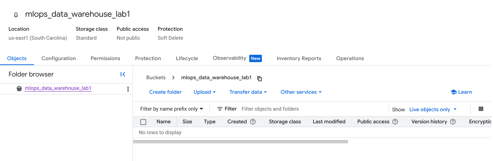
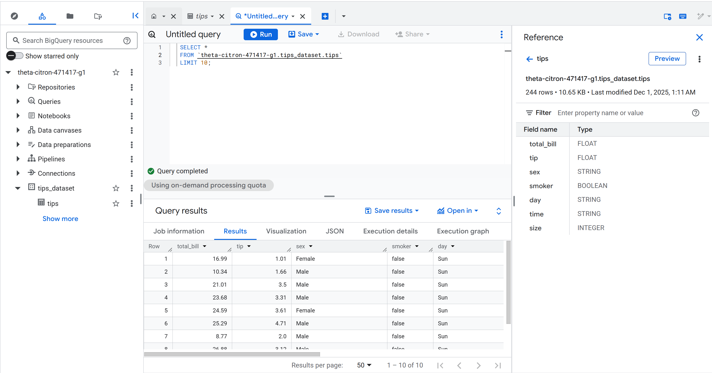
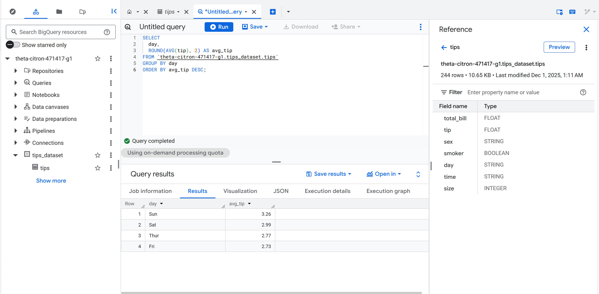

## GCP Storage & Warehouse Lab 1 – Activity Log

This file summarizes what I actually did in this lab session.

---

### 1. Local Setup
- **Workspace**: `Data_Storage_Warehouse_Labs/Lab1`
- **Dataset I chose**: Seaborn `tips` dataset
  - I downloaded it as `data/tips.csv`.

---

### 2. Google Cloud Storage (GCS)
- **Bucket I created**
  - Name: `mlops_data_warehouse_lab1` (in my GCP project).
- **Authenticated my local environment**
  - I ran `gcloud auth login`.
  - I set the active project with `gcloud config set project <my-project-id>`.
- **Verified bucket access**
  - I ran: `gsutil ls gs://mlops_data_warehouse_lab1`.
- **Uploaded dataset to the bucket**
  - I ran:  
    `gsutil cp data/tips.csv gs://mlops_data_warehouse_lab1/data/tips.csv`.
- **Enabled object versioning on the bucket**
  - I ran:  
    `gsutil versioning set on gs://mlops_data_warehouse_lab1`.

**Related screenshot I captured**



---

### 3. BigQuery – Dataset and Table
- **BigQuery setup**
  - I opened BigQuery in the GCP Console for project `theta-citron-471417-g1`.
- **Dataset I created**
  - Dataset ID: `tips_dataset`.
- **Table I created from GCS**
  - Table ID: `tips`.
  - Source URI: `gs://mlops_data_warehouse_lab1/data/tips.csv`.
  - File format: `CSV`.
  - Schema: auto-detected by BigQuery.

**Related screenshot I captured**



---

### 4. BigQuery – Queries I Actually Ran
- **Simple select query**
  - I verified the data load with:
    ```sql
    SELECT *
    FROM `theta-citron-471417-g1.tips_dataset.tips`
    LIMIT 10;
    ```
- **Average tip by day**
  - I ran:
    ```sql
    SELECT
      day,
      ROUND(AVG(tip), 2) AS avg_tip
    FROM `theta-citron-471417-g1.tips_dataset.tips`
    GROUP BY day
    ORDER BY avg_tip DESC;
    ```

**Related screenshots I captured**





---

### 5. Summary
- I set up a GCS bucket and uploaded `tips.csv`.
- I enabled bucket versioning.
- I created a BigQuery dataset `tips_dataset` and table `tips` from the GCS CSV.
- I successfully ran:
  - A simple `SELECT * ... LIMIT 10` query.
  - An aggregation query for **average tip by day**.
