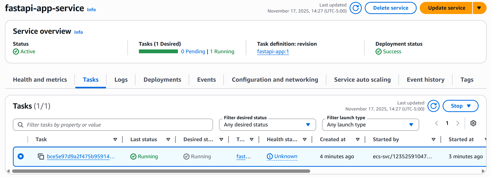
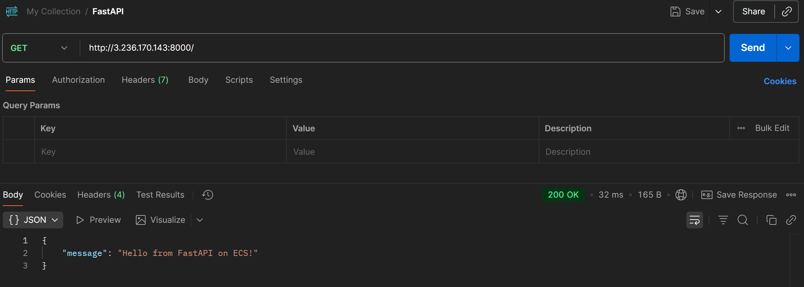

# Deployment Changes

## What I Did

I deployed a simple FastAPI Python endpoint on AWS using ECS Fargate and ECR. The application runs in a container and is accessible via a public IP address.

## Architecture

- **FastAPI** - Python web framework for the API
- **ECS Fargate** - Serverless container platform (no EC2 to manage)
- **ECR** - Docker image registry
- **Default VPC** - Using AWS default VPC to keep it simple
- **Public IP** - Tasks get public IPs directly (no load balancer needed)

## Files Created

### Application Code
- `app/app.py` - FastAPI app with `/` and `/health` endpoints
- `app/requirements.txt` - FastAPI and uvicorn dependencies
- `app/Dockerfile` - Container image definition

### Terraform Files
- `variables.tf` - Configurable settings (region, app name, CPU, memory)
- `main.tf` - All AWS resources (ECR, ECS cluster, task definition, service, security group)
- `outputs.tf` - Outputs like ECR URL and cluster name

## Key Resources Created

1. **ECR Repository** - Stores the Docker image
2. **ECS Cluster** - Where containers run
3. **ECS Task Definition** - Container configuration (256 CPU, 512 MB memory, port 8000)
4. **ECS Service** - Keeps 1 task running with public IP
5. **Security Group** - Allows inbound traffic on port 8000

## Deployment Steps

1. **Deploy infrastructure:**
   ```bash
   terraform init
   terraform apply
   ```

2. **Build and push Docker image:**
   ```bash
   ECR_URL=$(terraform output -raw ecr_repository_url)
   aws ecr get-login-password --region us-east-1 | docker login --username AWS --password-stdin $ECR_URL
   docker build -t fastapi-app ./app
   docker tag fastapi-app:latest $ECR_URL:latest
   docker push $ECR_URL:latest
   ```

3. **Access the API:**
   - Get task public IP from ECS console
   - Visit `http://<task-public-ip>:8000`

## Screenshots

### AWS Services


Shows the ECS cluster, service, and task running with public IP.

### API Test


Shows successful API call returning `{"message": "Hello from FastAPI on ECS!"}`.

